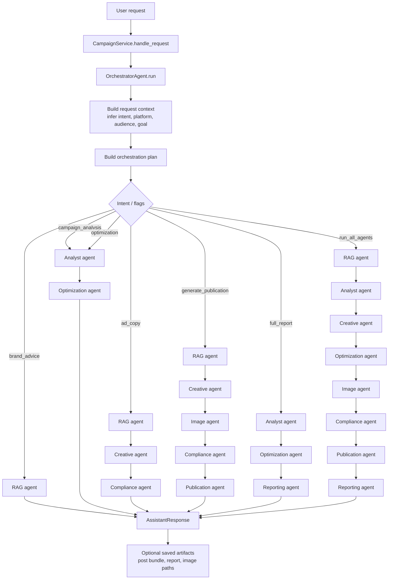

# Agentic OneBotAds

Agentic OneBotAds is a local-first multi-agent advertising assistant. It retrieves private brand context with RAG, analyzes campaign performance, drafts ad copy, generates image prompts, runs compliance checks, and assembles publication-ready outputs for review.

The web app now includes a unified `Marketing Assistant` workspace that can take one request, optional campaign CSV data, and return a combined multi-agent response covering analysis, optimization, copy, publication assets, and reports. Optimization and image generation now consume richer cross-agent context, so recommendations can reflect campaign breakdown plus brand guidance, and image prompts can reflect campaign goal, headline, CTA, and brand constraints instead of a generic template alone.

## Stack

- Python and FastAPI for the backend
- LangChain for prompt orchestration and tool wrappers
- LlamaIndex plus ChromaDB for persistent RAG
- Ollama with `qwen3:8b` and `nomic-embed-text:latest`
- Ollama for local text generation, with optional hosted Qwen Image support when image generation is enabled

## Orchestrator And Agent Logic


## Local Setup

### Backend on Windows

Use Python `3.11` or `3.12`. The project metadata intentionally rejects Python `3.13+`.

Package-based FastAPI setup:

```powershell
python -m venv .venv
.venv\Scripts\Activate.ps1
python -m pip install --upgrade pip setuptools wheel
pip install -e .[dev]
copy .env.example .env
python -m uvicorn onebot_ads.main:app --reload
```

Legacy CLI or `app.py` path:

```powershell
python -m venv .venv
.venv\Scripts\Activate.ps1
pip install -r requirements.txt
copy .env.example .env
python rag/build_index.py
python app.py --reload
```

### Backend on Linux or macOS

Use `python3.12` when available, otherwise `python3.11`.

If you use `pyenv`, a good local setup is:

```bash
pyenv install 3.12.13
pyenv local 3.12.13
```

Package-based FastAPI setup:

```bash
python3.12 -m venv .venv
source .venv/bin/activate
python -m pip install --upgrade pip setuptools wheel
pip install -e ".[dev]"
cp .env.example .env
python -m uvicorn onebot_ads.main:app --reload
```

Legacy CLI or `app.py` path:

```bash
python3.12 -m venv .venv
source .venv/bin/activate
pip install -r requirements.txt
cp .env.example .env
python rag/build_index.py
python app.py --reload
```

If `python3.12` is not available, use `python3.11` instead. On Bazzite, Homebrew or a dev container is usually the easiest way to add a compatible Python version.

### Frontend

Vite `7` requires Node.js `20.19+` or `22.12+`.

Windows:

```powershell
npm install --prefix apps/web
npm run dev --prefix apps/web
```

Linux or macOS:

```bash
npm install --prefix apps/web
npm run dev --prefix apps/web
```

### Optional Ollama bootstrap

Windows:

```powershell
ollama pull qwen3:8b
ollama pull nomic-embed-text:latest
```

Linux or macOS:

```bash
ollama pull qwen3:8b
ollama pull nomic-embed-text:latest
```

On Bazzite, the first-class container path is `podman` plus Quadlet rather than Docker. The app still only needs Ollama to answer on `http://localhost:11434`.

Frontend runs on `http://localhost:5173`. Backend runs on `http://127.0.0.1:8000`.

### Image Provider Options

- The checked-in local-first default keeps `ENABLE_IMAGE_GENERATION=false` so the app runs cleanly on your PC without any hosted image dependency.
- When you explicitly want hosted image generation, the only supported provider is `qwen_image`.
- To enable it, set `ENABLE_IMAGE_GENERATION=true`, `IMAGE_PROVIDER=qwen_image`, and keep `QWEN_IMAGE_SPACE_ID=Qwen/Qwen-Image-2512`.
- `generate_image_prompt=true` only returns prompt metadata. Actual image generation only runs when `generate_image=true`.
- Leave `HF_TOKEN` empty unless the Space needs authenticated access or you hit rate limits.
- Publication visuals are composed in code only after a background image is generated.
- Generated images are saved under `outputs/images` and served by FastAPI at `/outputs/images/...`.

## API Endpoints

- `GET /api/v1/health`
- `GET /api/v1/runtime`
- `POST /api/v1/campaigns/draft`
- `POST /api/v1/assistant/run`
- `POST /api/v1/rag/reindex`

## Knowledge Base Scoping

RAG now supports brand and campaign scoping through metadata filters instead of one mixed search pool.

Recommended layout:

```text
data/knowledge_base/
|- shared/
|  `- platform_ads_rules.md
`- brands/
   `- cuddlenest-plushies/
      |- brand_guidelines.md
      `- campaigns/
         `- spring-launch/
            `- brief.md
```

Request-level scoping:

- `POST /api/v1/assistant/run` accepts optional `product_name`, `audience`, `goal`, `platform`, and `knowledge_scope`
- `POST /api/v1/campaigns/draft` accepts optional `brand_name`, `campaign_name`, and `knowledge_scope`

Example assistant payload:

```json
{
  "message": "Create a launch campaign for CuddleNest Plushies.",
  "product_name": "CuddleNest Plushies",
  "platform": "Instagram",
  "audience": "parents and gift buyers",
  "goal": "increase first-time sales",
  "campaign_csv_content": "campaign_id,impressions,clicks,spend,conversions,revenue\n...",
  "campaign_csv_filename": "spring_launch.csv",
  "knowledge_scope": {
    "brand_name": "CuddleNest Plushies",
    "campaign_name": "Spring Launch"
  }
}
```

