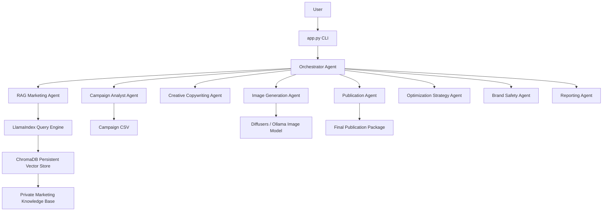

# Architecture

## System Overview

Agentic OneBotAds is a local-first advertising assistant with a thin CLI and FastAPI API on top of a Python multi-agent backend. The orchestrator classifies the request, invokes the right specialist agents, and returns structured outputs for review instead of directly publishing ads.

## Component Roles

- LangChain: prompt orchestration, optional `ChatOllama` interactions, and tool wrappers.
- LlamaIndex: document ingestion, vector indexing, and query engine access for private marketing context.
- Ollama: local text LLM provider for `qwen3:8b` and the `nomic-embed-text:latest` embedding model.
- ChromaDB: persistent vector storage under `vector_store/chroma`.

## Agent Flow

## Publication Workflow

1. The orchestrator detects a publication request and infers defaults such as `LinkedIn`, `SMEs and marketing teams`, and `professional, modern, direct`.
2. The RAG agent retrieves product, tone, and rules context from the private knowledge base.
3. The creative agent generates structured copy and A/B variants.
4. The image agent creates a prompt and optionally calls the image tool when generation is enabled and requested.
5. The compliance agent validates the copy and prompt.
6. The publication agent assembles the publication package with schedule and status.

## Campaign Analysis Workflow

1. The analyst agent loads `data/campaigns.csv`.
2. It calculates CTR, conversion rate, CPA, ROAS, ROI, and campaign-level metrics.
3. It identifies the strongest and weakest campaigns and returns actionable insights.
4. The optimization agent converts those findings into budget and test recommendations when needed.

## Optimization Workflow

1. Campaign analysis results feed the optimization agent.
2. The optimization agent prioritizes quick wins versus strategic changes.
3. The final response includes what to scale, what to reduce, and what experiments to run next.
